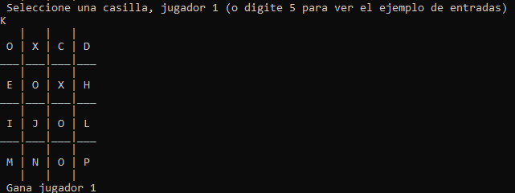

# TIC-TAC-TOE 4x4
 
## Reglas del juego
 
Por turnos, cada jugador selecciona la letra correspondiente a la casilla 
donde desea poner su jugada (puede seleccionar 5 para recibir las instrucciones).

Un 1 o 2 aparecera en la casilla correspondiente al jugador1 o jugador2.

Se gana el juego cuando alguno de los jugadores logre jugar 3 casillas horizontales, verticales o diagoles. 

CUIDADO! Cada 5 turnos se elimina la jugada mas antigua dejando la casilla 
utilizable. No se pueden jugar las casillas centrales en el primer turno 
ni se puede jugar una casilla que ya tenga un numero. 

